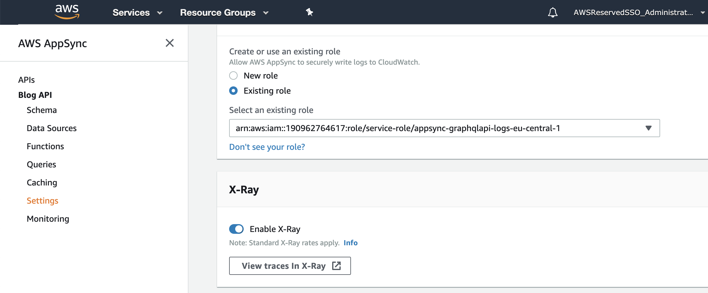
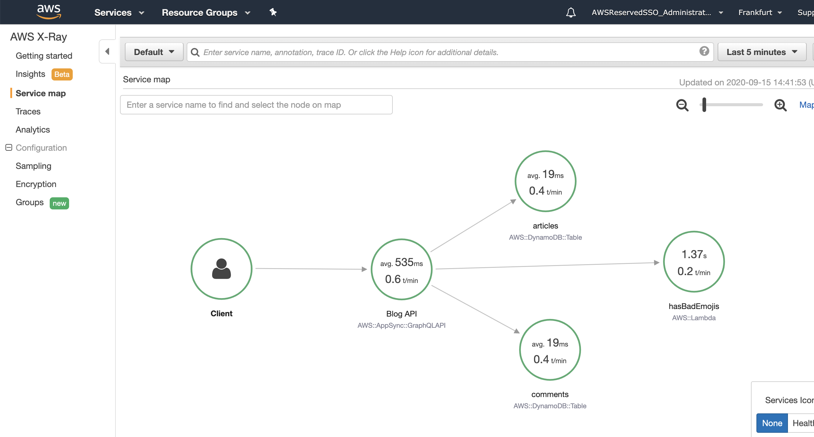
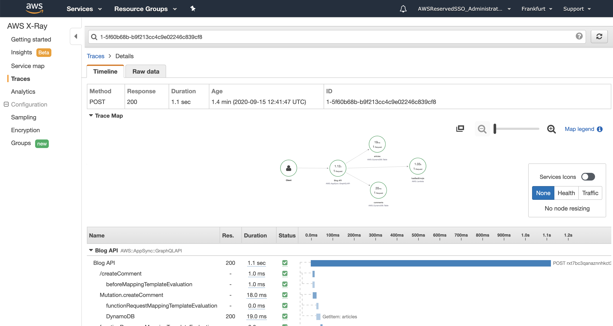
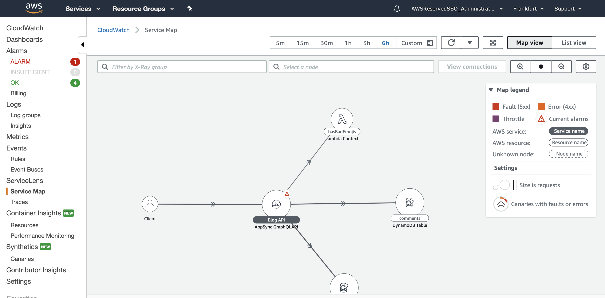

# Tracing

## In this lab …

* Enable tracing for your AppSync API
* Understand X-Ray
* Use Cloudwatch ServiceLens

## Tracing

Implementing a Serverless architecture means connecting a lot of different services together. 
All this services can fail in certain situations and introduce errors into your system. 
In order to gain the necessary insights into the behaviour and performance of your application, 
you will learn how to facilitate AWS’ tracing service X-RAY.

## Enable Tracing

Tracing via X-Ray is not enable by default. So let's do this real quick:

1. Go back to the [AppSync console](console.aws.amazon.com/appsync) and select the API
1. Go to the setting in menu on the left
1. Scroll down until you find the setting to **Enable X-Ray**
1. Click on **Save**

Now we need to generate some traces. So use the different actions of the API. 
Make sure to not only query data but also create some articles and comments.

## Understanding X-Ray

Now, that we generated some traces by calling our API, we can take a look at X-Ray and trying to make some sense of it:

1. Open the [X-Ray console](https://console.aws.amazon.com/xray/home)
1. Open the **Service map** and take a look at the involved services. You should see 
    - the AppSync API
    - two DynamoDB tables
    - the Lambda function
1. Click on the different services and take a look at the **Service details**

Let's take a closer look at a single trace: 

1. Click on **Traces** in the navigation on the left
1. Pick a trace and click on it's **ID**
1. In the upper part you can see the involved services in the service map again
1. In the lower part we find a time chart with all the segments of the trace, and their duration contributing to the overall latency of the request

## Cloudwatch ServiceLens

AWS has another tool to present the same tracing data: Cloudwatch ServiceLens. 
It combines data from X-Ray, Cloudwatch Metrics and Cloudwatch Logs in one UI.

1. Open the [ServiceLens console](https://console.aws.amazon.com/cloudwatch/home?region=eu-central-1#servicelens:)
1. Find your **Service Map** and the **Traces**
1. Try to find the traces we looked at earlier and compare the different presentations  

